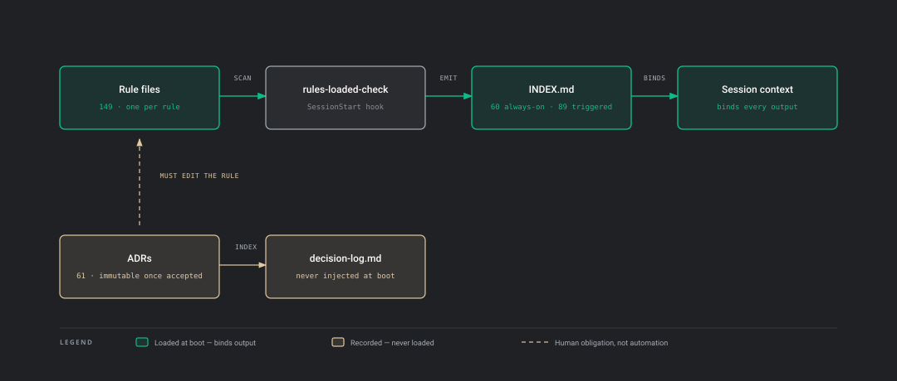
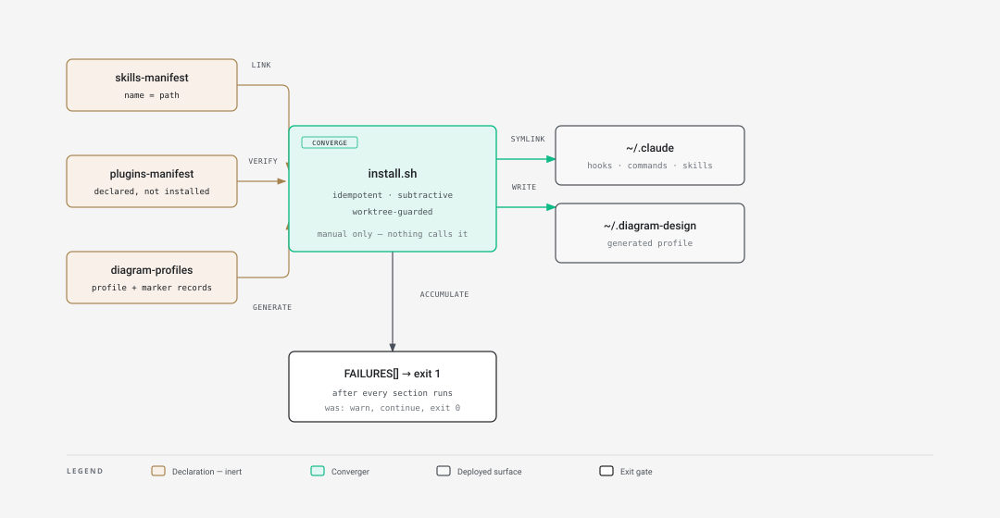
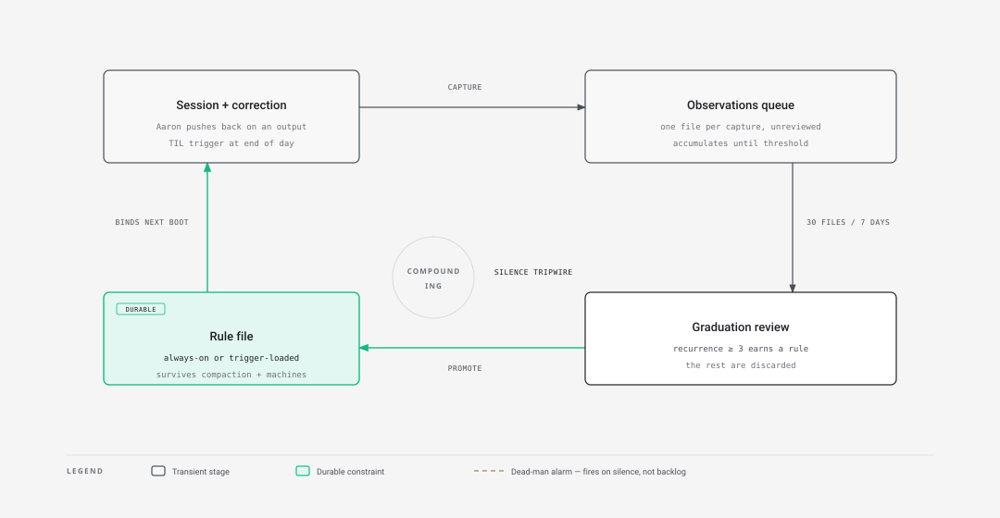
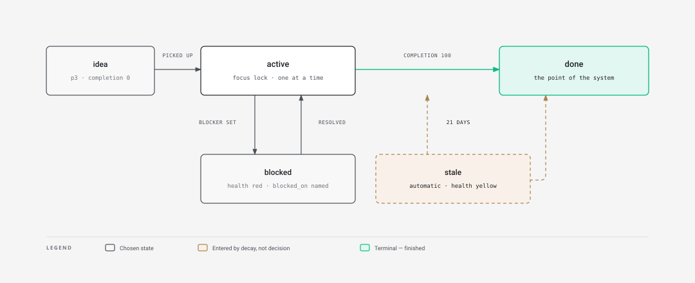
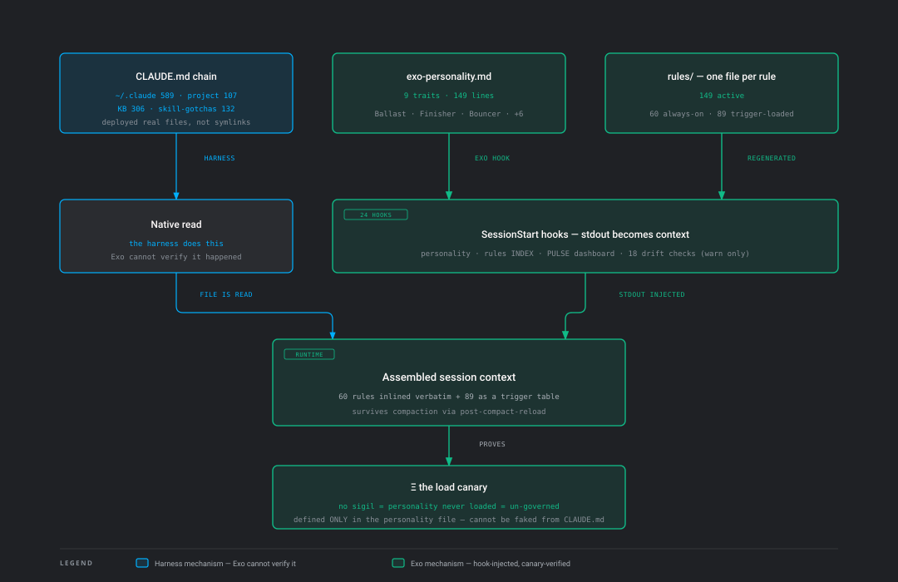

# Architecture plates

## Read this first

**These diagrams describe the author's full system, not the repository you just cloned.**

Parts of that system are deliberately left out. I am not interested in publishing the specifics
of my security and governance setup, so what is here is the shape and not the wiring: no job
names, no assert names, no policy paths, no outbound send path. You can see the part of that work
which *is* public at [agentrust-io.com](https://agentrust-io.com).

This is a personal project I am sharing so other people can learn from it and tell me where it is
wrong. It is not a product, and it is not trying to become one. If a plate makes you think *"that
would break"* or *"there is a simpler way"* — open an issue. That is the contribution I want.

**The figures on these plates are counts from my own machine on 2026-09-14**, checked against disk
by a strict freshness gate before every push. The published repository ships a curated subset, so
its numbers are smaller and it would be misleading to read one as the other:

| | this repository ships | the plates show |
|---|---|---|
| skills | 14 | 18 |
| hooks | 5 | 26 |
| MCP servers | 1 (8 tools) | 15 |

---

## The whole thing, on one plate

Code and content are two substrates that deploy upward into the harness directory a live session
boots from. MCP servers and plugins attach from the sides. The work-skills repo is isolated on
purpose — zero outbound dependencies, so it survives everything else being rewritten.

## How governance actually reaches a session

The part people ask about most. Rules are one file each; an index is regenerated from them
whenever one changes; the index loads at boot. **The substrate is the rules, and the index is a
function of them** — which is why hand-editing the index is forbidden and why a rule cannot be
"active" without existing as a file.

## What install actually does to your machine

Worth reading before you run `install.sh` on anything you care about.

## The learning loop

Observations accumulate as a side effect of work rather than as a chore. A weekly pass proposes
what should graduate into a rule; a human approves. Nothing promotes itself.

## Project state, as a state machine

One file per project, and the states it can be in. `templates/pulse.md` in this repository is the
same idea, shipped.

## What a session has in its head before you type anything

Boot-time context assembly — what loads, in what order, and how a session proves it loaded rather
than assuming it did.

---

## What is not here, and why

One plate is deliberately withheld: the unattended outbound path — how an automated run is allowed
to send anything, and what stops it. That is the governance and security detail this page is not
disclosing, and it is also the plate a reader would learn least from, since it is specific to one
person's accounts.

The prose behind these plates stays private for the same reason. It names jobs, asserts, alarms
and paths, and that is a map rather than a diagram.

For the architecture of what you *did* clone, see [architecture.md](architecture.md).
